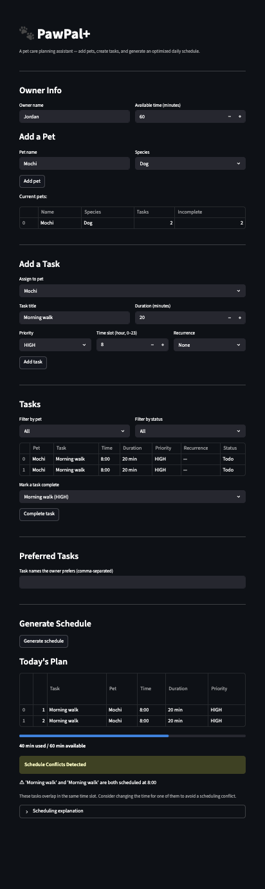

# PawPal+ (Module 2 Project)

**PawPal+** is a Streamlit-powered pet care planning assistant that helps busy pet owners organize, prioritize, and schedule daily care tasks across multiple pets.

## Demo

<a href="demo.png" target="_blank"></a>

## Features

### Scheduling Algorithm
- **Three-level priority sorting** — tasks are ranked by priority (HIGH > MEDIUM > LOW), then by owner preference (preferred task names break ties), then by time of day (earlier hours first). Uses a greedy algorithm to fit as many tasks as possible within available time.

### Conflict Detection
- **Time-slot collision warnings** — after scheduling, every pair of tasks is checked for duplicate time slots. Conflicts are surfaced as prominent `st.warning` banners in the UI with actionable advice, rather than silently ignored or causing crashes.

### Recurring Tasks
- **Daily and weekly recurrence** — completing a task marked `"daily"` or `"weekly"` automatically generates a new task instance with `due_date` shifted forward by 1 or 7 days using Python's `timedelta`. The new task is appended to the pet's task list.

### Task Filtering
- **Filter by pet and status** — `Owner.filter_tasks()` supports filtering by pet name, completion status (incomplete/completed), or both. The UI exposes this via two dropdown selectors.

### Smart Skipping
- **Completed tasks excluded** — the scheduler automatically skips finished tasks so they don't consume available time. The explanation log notes each skipped task and why.

### Task Completion in UI
- **Mark tasks done in-app** — an interactive dropdown lets owners complete tasks directly. For recurring tasks, a banner shows the next occurrence date.

### Schedule Transparency
- **Explanation log** — every scheduling run produces a human-readable explanation of what was added, skipped, and why, viewable in a collapsible expander. Conflict warnings appear inline.

## Getting Started

### Setup

```bash
python -m venv .venv
source .venv/bin/activate  # Windows: .venv\Scripts\activate
pip install -r requirements.txt
```

### Run the App

```bash
streamlit run app.py
```

### Run Tests

```bash
python -m pytest tests/test_pawpal.py -v
```

## Testing PawPal+

The test suite contains **23 tests** organized into 5 behavior groups:

| Group | Tests | What It Verifies |
|-------|-------|------------------|
| **Recurrence Logic** | 5 | Daily tasks create a next-day task, weekly shifts by 7 days, non-recurring returns `None`, `due_date=None` falls back to today |
| **Sorting Correctness** | 5 | Tasks scheduled in priority order (HIGH > MEDIUM > LOW), preferred names break ties, earlier times break remaining ties, empty/oversized inputs handled |
| **Conflict Detection** | 3 | Duplicate time slots produce a warning, distinct times produce none, empty schedule is clean |
| **Task Filtering** | 5 | Filter by pet name, completion status, or both; nonexistent pet and no-pets edge cases return `[]` |
| **Completed Tasks Skipped** | 3 | Completed tasks excluded from schedule, explanation notes the skip, all-completed yields empty schedule |
| **Basic Operations** | 2 | `mark_complete()` flips status, tasks can be added to a pet |

### Confidence Level

**Confidence: 4/5 stars**

All 23 tests pass across happy paths and edge cases for every core behavior. The one star withheld is because the test suite does not yet cover duration-based time overlap (only exact hour matches are detected) or integration testing with the Streamlit UI layer.

## Project Structure

```
pawpal_system.py    — Core classes: Owner, Pet, Task, Schedule, Priority
app.py              — Streamlit UI wired to the backend
tests/test_pawpal.py — 23 pytest tests covering all core behaviors
uml_diagram.md      — Final UML class diagram (Mermaid)
uml_diagram.puml    — Final UML class diagram (PlantUML)
docs/               — Algorithm enhancement notes and test behavior docs
reflection.md       — Design decisions and tradeoff rationale
```
