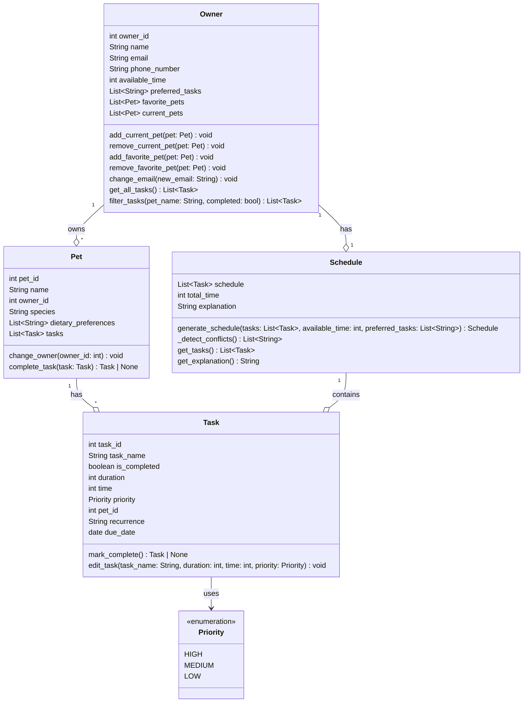

```mermaid
classDiagram

    class Priority {
        <<enumeration>>
        HIGH
        MEDIUM
        LOW
    }

    class Owner {
        int owner_id
        String name
        String email
        String phone_number
        int available_time
        List~String~ preferred_tasks
        List~Pet~ favorite_pets
        List~Pet~ current_pets
        add_current_pet(pet: Pet) void
        remove_current_pet(pet: Pet) void
        add_favorite_pet(pet: Pet) void
        remove_favorite_pet(pet: Pet) void
        change_email(new_email: String) void
        get_all_tasks() List~Task~
        filter_tasks(pet_name: String, completed: bool) List~Task~
    }

    class Pet {
        int pet_id
        String name
        int owner_id
        String species
        List~String~ dietary_preferences
        List~Task~ tasks
        change_owner(owner_id: int) void
        complete_task(task: Task) Task | None
    }

    class Task {
        int task_id
        String task_name
        boolean is_completed
        int duration
        int time
        Priority priority
        int pet_id
        String recurrence
        date due_date
        mark_complete() Task | None
        edit_task(task_name: String, duration: int, time: int, priority: Priority) void
    }

    class Schedule {
        List~Task~ schedule
        int total_time
        String explanation
        generate_schedule(tasks: List~Task~, available_time: int, preferred_tasks: List~String~) Schedule
        _detect_conflicts() List~String~
        get_tasks() List~Task~
        get_explanation() String
    }

    Owner "1" --o "*" Pet : owns
    Owner "1" --o "1" Schedule : has
    Pet "1" --o "*" Task : has
    Schedule "1" --o "*" Task : contains
    Task --> Priority : uses
```
